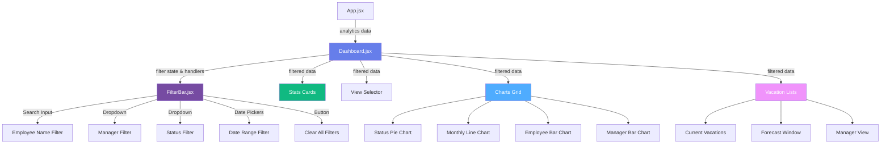
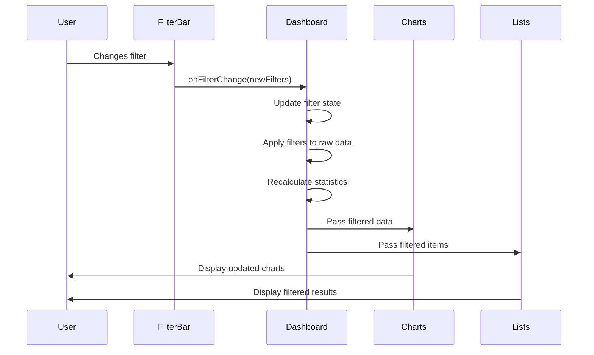
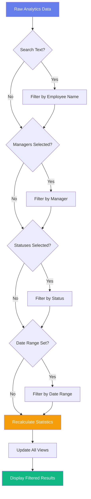
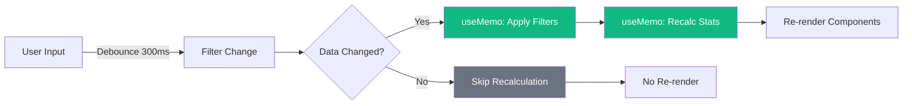

# Filter Implementation Architecture

## Component Hierarchy & Data Flow



## Filter State Structure

```javascript
const [filters, setFilters] = useState({
  searchText: '',           // Employee name search
  managers: [],             // Array of selected managers
  statuses: [],             // Array of selected statuses
  dateRange: {
    start: null,            // Start date (Date object or null)
    end: null               // End date (Date object or null)
  }
});
```

## Data Flow Sequence



## Filter Logic Flow



## Component Interaction

### FilterBar Component
**Responsibilities:**
- Render all filter controls
- Manage local input states
- Emit filter changes to parent
- Display active filter count
- Provide clear filters action

**Key Methods:**
```javascript
handleSearchChange(text)
handleManagerChange(selectedManagers)
handleStatusChange(selectedStatuses)
handleDateRangeChange(start, end)
handleClearFilters()
```

### Dashboard Component
**Responsibilities:**
- Maintain filter state
- Apply filters to raw data
- Recalculate statistics from filtered data
- Pass filtered data to child components
- Coordinate view updates

**Key Methods:**
```javascript
applyFilters(items, filters)
recalculateStats(filteredItems)
handleFilterChange(newFilters)
getUniqueManagers(items)
getUniqueStatuses(items)
```

## Performance Optimization



## Filter Application Algorithm

```javascript
function applyFilters(items, filters) {
  return items.filter(item => {
    // 1. Search text filter (case-insensitive)
    if (filters.searchText) {
      const searchLower = filters.searchText.toLowerCase();
      const nameMatch = item.employeeName?.toLowerCase().includes(searchLower);
      if (!nameMatch) return false;
    }
    
    // 2. Manager filter (OR logic for multiple managers)
    if (filters.managers.length > 0) {
      if (!filters.managers.includes(item.manager)) return false;
    }
    
    // 3. Status filter (OR logic for multiple statuses)
    if (filters.statuses.length > 0) {
      if (!filters.statuses.includes(item.status)) return false;
    }
    
    // 4. Date range filter (AND logic)
    if (filters.dateRange.start) {
      const itemStart = new Date(item.startDate);
      if (itemStart < filters.dateRange.start) return false;
    }
    
    if (filters.dateRange.end) {
      const itemEnd = new Date(item.endDate);
      if (itemEnd > filters.dateRange.end) return false;
    }
    
    // All filters passed
    return true;
  });
}
```

## UI Layout Structure

```
┌─────────────────────────────────────────────────────────────┐
│                     Dashboard Header                         │
└─────────────────────────────────────────────────────────────┘
┌─────────────────────────────────────────────────────────────┐
│                      FilterBar Component                     │
│  ┌──────────┐ ┌──────────┐ ┌──────────┐ ┌────────────────┐ │
│  │  Search  │ │ Manager  │ │  Status  │ │   Date Range   │ │
│  │   Box    │ │ Dropdown │ │ Dropdown │ │     Picker     │ │
│  └──────────┘ └──────────┘ └──────────┘ └────────────────┘ │
│  [Clear All Filters] [Active: 3 filters]                    │
└─────────────────────────────────────────────────────────────┘
┌─────────────────────────────────────────────────────────────┐
│                    Stats Cards (Filtered)                    │
│  ┌──────────┐ ┌──────────┐ ┌──────────┐ ┌──────────┐      │
│  │  Total   │ │ Current  │ │ Forecast │ │ Managers │      │
│  │ Requests │ │Vacations │ │(3 Months)│ │          │      │
│  └──────────┘ └──────────┘ └──────────┘ └──────────┘      │
└─────────────────────────────────────────────────────────────┘
┌─────────────────────────────────────────────────────────────┐
│                       View Selector                          │
│  [Overview] [Forecast] [Managers] [Current]                 │
└─────────────────────────────────────────────────────────────┘
┌─────────────────────────────────────────────────────────────┐
│                   Content Area (Filtered)                    │
│  Charts / Lists based on selected view                       │
└─────────────────────────────────────────────────────────────┘
```

## Implementation Phases

### Phase 1: Core Components
1. Create FilterBar.jsx with basic structure
2. Create FilterBar.css with styling
3. Add filter state to Dashboard.jsx

### Phase 2: Filter Logic
4. Implement applyFilters function
5. Integrate filtering with existing data flow
6. Update statistics calculation

### Phase 3: UI Integration
7. Add FilterBar to Dashboard
8. Connect filter handlers
9. Update all views to use filtered data

### Phase 4: Polish & Testing
10. Add visual feedback (badges, counts)
11. Implement clear filters
12. Test all combinations
13. Optimize performance
